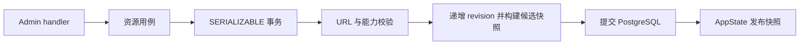

# 后端分层与维护约束

本轮治理基于 2026-09-08 的 `main` `de708e8`，实现位于 `codex/backend-architecture-governance`。总体领域与协议约束仍以 [设计文档](ai-gateway-design.md) 为准。本文记录模块职责、治理范围和验证边界。

## 模块职责

| 模块 | 职责与边界 |
| --- | --- |
| `runtime`、`app` | 启动、依赖装配、后台任务、Router 和中间件注册 |
| `api` | HTTP 提取、鉴权检查、调用服务、状态码与响应；生产 handler 不直接执行 SQL |
| `auth` | Admin Key 校验、Virtual Key 身份解析、恒定时间摘要比较；数据库依赖由调用方显式传入 |
| `state` | 共享依赖和运行时快照发布；不承担鉴权、凭据解析或 HTTP 错误序列化 |
| `control_plane` | 控制面用例、事务、持久化约束与候选快照；对外只导出服务、输入类型、错误及快照 |
| `domain` | 配置、目录、协议、能力及路由规则；不依赖 `api`、`state`、`proxy` 或控制面服务 |
| `proxy` | 数据面请求编排、fallback、上游调用、SSE 生命周期与用量结算 |
| `http`、`source_url` | 共享 HTTP client、URL/SSRF/DNS/重定向策略及 HTTP 错误封装 |
| `infra` | PostgreSQL、Secret Resolver、健康、审计、运维与可观测性 |

这是单 crate 内的职责分层。领域枚举的 SQLx 类型映射和 Provider preset 的 URL 解析仍使用现有库；`infra/health`、`infra/ops` 也保留既有的探测与导入编排职责，不能据目录名称将其理解为完全独立的底层存储库。

## 控制面写入

`control_plane/service.rs` 负责事务生命周期、初始化和快照装载。资源用例分别位于 `sources.rs`、`accounts.rs`、`models.rs`、`bindings.rs`、`routes.rs`；SQL 读辅助和健康状态更新在 `repository.rs`，校验在 `validation.rs`，配置导入在 `import.rs`，快照构建在 `snapshot.rs`，边界数据与错误在 `types.rs`、`error.rs`。

- 更新用例共享 `finish_mutation` / `finish_write`。提交前发生 SQL、能力或快照错误时，事务回滚，handler 不发布候选状态。
- `load_snapshot` 在 `REPEATABLE READ READ ONLY` 事务中调用 `load_snapshot_in_transaction`；备份恢复复用相同的候选构建路径。
- 运行时继续拒绝旧 revision 覆盖新 revision。读者取得完整 `LiveConfig`，没有字段级半更新。
- 账号密文轮换现由 `ControlPlane::rotate_account_credential` 加锁、更新、校验和提交，handler 在成功后发布快照。修复原 handler 忽略 SQL 写入错误、成功后运行时仍保留旧密文的问题。
- 模型发现和确认保持既有领域语义；测试专用的 Source 集合路由与目录构造辅助使用 `cfg(test)` 隔离，不编入生产控制面。

## 数据面与公共能力

上游额度查询遵循相同分层：`api/upstream_quota.rs` 只处理 HTTP 输入和响应；
`control_plane/quota` 提供只读查询服务，`repository.rs` 读取账号/来源，
`providers.rs` 解析各 Provider 的额度格式。服务显式接收连接池、共享
`SourceHttpClient` 和 `SecretResolver`，不依赖 `AppState` 或 Axum 响应类型。
列表不返回原始上游内容；详情、状态码、鉴权、10 秒超时及 1 MiB 响应上限保持原有契约。
`tests/architecture_tests.rs` 随默认 Rust 测试运行，检查 API 直接 SQL 调用及额度服务的
HTTP handler 依赖。这是源码级边界检查，不替代完整依赖审查。

`proxy/service.rs` 保留北向请求编排。`attribution.rs` 处理客户端来源，`policy.rs` 处理重试与健康结果，`forward.rs` 执行上游转发，`fallback.rs` 选择和尝试候选账号，`accounting.rs` 结算流式请求及 attempts。`stream.rs`、`transport.rs`、`usage.rs` 继续负责流生命周期、HTTP transport 和 usage 解析。

首选账号、实际 Source/Provider/upstream model 归因、协议顺序、截断与取消语义沿用原有实现。非生产 Adapter 测试替身只存在于 `cfg(test)`；生产注册表仍为空。

公共能力由明确的所有者提供：

- API 和代理共享 `http::response` 错误封装，保留 OpenAI/Anthropic 错误形状和 request ID。
- `SecretResolver` 负责账号凭据解析、加密和轮换；handler 和代理复用账号 AAD 规则。
- 健康接口通过数据库方法读取账号元信息，SQL 不留在 HTTP handler。
- 跨模块使用 `pub(crate)`，控制面与代理内部辅助优先使用 `pub(super)`，不以转发别名保留旧内部路径。
- `lib.rs` 使用常规模块声明；原 `include!("main_tests.rs")` 改为独立测试模块，共享环境 fixture 位于 `test_helpers.rs`。

## 死代码与依赖

移除未使用的配置类型别名、重复 Adapter feature 访问器、未接入的事务审计函数、旧 Virtual Key 更新/迁移/轮换包装器、Secret 和健康辅助、旧 DB CRUD/装载包装器以及无调用的转发入口。仍被迁移或行为测试使用的辅助显式限制到 `cfg(test)`，内存 Gateway 构造限定为测试或 `test-support`。

移除未使用的直接依赖 `async-trait`，将 `tower`、`http-body-util` 限定为 dev dependencies，并删除重复 Tokio dev 声明。没有新增运行时依赖或数据库 migration。

Cargo 将 `dead_code` 设为 `deny`。新增代码不能通过宽泛的 `allow(dead_code)` 隐藏未接入实现。`mise run lint` 的 Clippy 同时检查 `test-support` 目标，覆盖原先未参与该门禁的 Contract 测试。

## 验证

使用 `mise.toml` 锁定的 Rust 1.97.1；本机通过 `rustup run 1.97.1` 执行相同工具链，Cargo 缓存位于 `/tmp/my-ai-gateway-cargo`。

- 生产配置：`cargo check --workspace`。
- 所有 Rust 目标：`cargo clippy --all-targets --features test-support -- -D warnings`、`cargo fmt --all -- --check`。
- 默认回归及三协议 Contract：`cargo test --workspace --features test-support -- --test-threads=1`。
- 独立 PostgreSQL：`TEST_DATABASE_URL=... cargo test --workspace --features test-support -- --include-ignored --test-threads=1`；测试容器为本机独立 PostgreSQL 17，测试不得复用生产库。
- 新增凭据轮换回归覆盖 HTTP 成功、运行时新密文可解密、SQL 写失败回滚、候选快照校验失败回滚、账号缺失及无密文错误契约。

2026-09-08 本地执行结果：

| 验证 | 结果 |
| --- | --- |
| 生产 `cargo check --workspace` / `cargo build --workspace` | 通过 |
| Rustfmt / Clippy（全部目标，包含 `test-support`，拒绝 warning） | 通过 |
| 完整 Rust 回归，包含显式 PostgreSQL 测试 | 219 个单元及数据库测试 + 90 个 Contract + 35 个 Mock Provider 测试；344 通过、0 失败、0 跳过 |
| Contract 测试门禁风格修正后复跑 | 90 通过、0 跳过 |
| `git diff --check`、文档相对链接检查 | 通过 |

本轮只涉及后端和相应 Rust 测试，没有重跑 Web lint/build/test，也没有将这些 Rust 检查记作完整 `mise run verify`。真实 Provider、生产部署、性能基线及 #96/#97/#98 的生产复验不属于本轮本地验证结论。

关联任务：[后端分层、公共能力与死代码治理 #164](https://github.com/jianyun8023/my-ai-gateway/issues/164)。范围与本地验证以上述记录为准；PR CI 和合并状态以 GitHub 实时记录为准。
