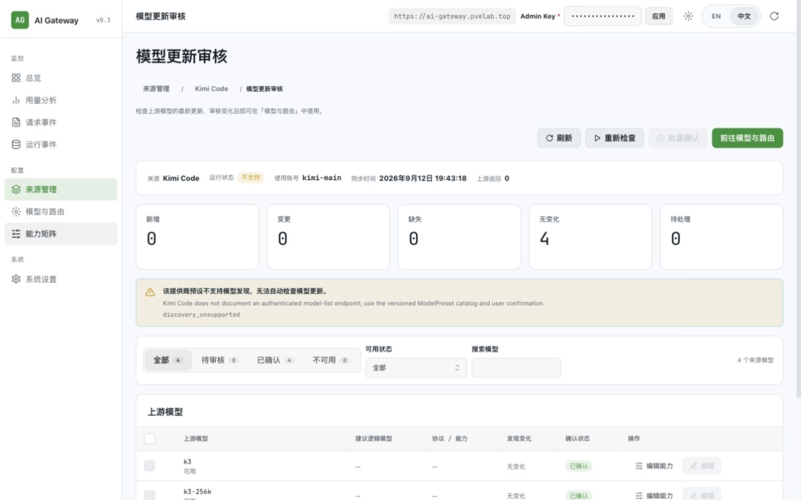
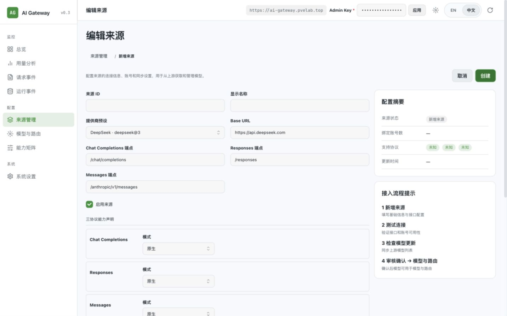
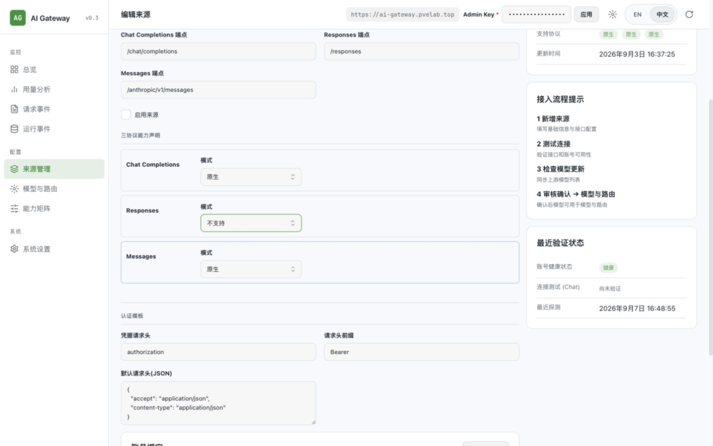

# PR #200 浏览器验证与前后端规范审计

审计日期：2026-09-12（Asia/Singapore）。

审计对象：[PR #200](https://github.com/jianyun8023/my-ai-gateway/pull/200)，合并提交 `d4639baf867167450ec656680873d30f81d8e3ae`；需求依据：[Issue #199](https://github.com/jianyun8023/my-ai-gateway/issues/199)。

部署环境：[来源管理](https://ai-gateway.pvelab.top/admin/#sources)。本地检查位于 `main 0c4d2f8`；本次涉及的来源列表、详情、编辑、审核组件及同步统计逻辑与 PR #200 合并版本无差异。部署提交依据用户提供的信息，未独立取得部署镜像 SHA。

结论：发现 **8 项功能问题（1 项 P1、7 项 P2）**，另有状态命名、国际化及文档问题。页面主体可访问，相关既有静态检查和回归通过，但尚不能判定 #199 已完整验收。

## 1. 需要修复的问题

### F1 · P1 · 搜索后的“全选”会包含被搜索隐藏的待审核模型

- **证据类型：代码审计 + 本地组件复现。**
- 复现：准备两个可用、待审核模型 `upstream-a`、`upstream-b`；搜索 `upstream-a`，表格只剩一行；点击“选择全部可确认模型”。
- 实际：“批量确认 (2)”。`confirmSelected` 仍会将两个模型交给确认 API。
- 影响：用户按搜索结果批量审核时，会把当前表格中未看到的模型一并确认。确认不会自动建立路由，但会改变这些模型的审核状态。
- 原因：`eligibleModels` 基于状态筛选后的 `visibleModels`；搜索另行生成 `filteredModels`，没有参与全选或提交范围。
- 定位：`web/src/features/control-plane/sources/ModelReviewPage.tsx:112,165,169,190,334`。
- 修复方向：全选、选中数量、确认提交共同使用明确的搜索结果范围；搜索变化时清除或显式处理隐藏选择。

### F2 · P2 · 批量检查将 failed / unsupported 计为成功

- **证据类型：前后端契约审计 + 本地组件复现。**
- 复现：让检查接口按现有契约返回 HTTP 200，同时 `data.run.status` 分别为 `failed` 或 `unsupported`；点击“批量检查更新”。
- 实际：两种情况均通知“批量检查更新完成：成功 1 个，失败 0 个。”
- 原因：只要 `api.runDiscovery()` 没有抛出异常，就执行 `succeeded += 1`。后端会正常记录失败/不支持的运行，并将该运行对象作为 HTTP 200 响应返回。
- 定位：`SourcesPage.tsx:126–138`；后端 `src/api/discovery.rs:326–335`、`src/control_plane/model_discovery.rs:350–381,590–630`。
- 规范：`design.md:104` 要求 succeeded / failed / unsupported 由运行结果表达，不能提前宣告发现成功。列表和详情的单项检查也新增了独立成功通知。
- 修复方向：按 `run.status` 分类统计，单独表达不支持；保留持久运行结果与刷新失败反馈，不更改后端状态码来迁就错误的前端判断。

### F3 · P2 · 顶部“三协议测试连接”吞掉请求错误

- **证据类型：代码审计 + 本地组件复现。**
- 复现：让三条连接测试请求都返回 HTTP 503 结构化错误，点击详情页顶部“测试连接”。
- 实际：加载结束后没有错误提示；复现中页面不存在错误 alert。
- 原因：每个请求的 catch 返回 `undefined`，合并时过滤这些结果，并清空此前的 `testError`。若页面已有成功结果，本次失败的协议还会保留旧结果。
- 定位：`web/src/features/control-plane/sources/SourceDetailPage.tsx:126–145`。
- 规范：`docs/frontend-architecture.md` 的错误处理规则及 `design.md:103` 要求持久展示提交失败、错误码与重试途径。
- 修复方向：逐协议保留本次失败及错误信息，明确区分历史结果，不能把失败转换为无结果。

### F4 · P2 · 详情页检查更新没有请求期间的防重复提交

- **证据类型：代码审计 + 本地组件复现。**
- 复现：保持第一次检查请求未完成，再次点击同一个“检查模型更新”按钮。
- 实际：发出两次 POST；复现断言期望 1 次，实际 2 次。
- 原因：动作只判断 `detailQuery.refreshing`，这个状态属于读取查询，不覆盖 `runDiscovery` 执行期间；两个检查入口都没有独立 mutation busy 状态。
- 定位：`SourceDetailPage.tsx:149–164,207,268`。
- 影响：重复调用上游并写入检查记录；有变化时，后续重复检查还可能让最近一次 diff 变成空结果。
- 规范：`design.md:61,120` 的加载禁用与防重复提交要求。
- 修复方向：两个入口共享检查动作的进行中状态，覆盖请求开始至结束。

### F5 · P2 · 未能同步的来源仍显示“无变化”

- **证据类型：部署环境浏览器复现 + 代码审计。**
- 页面：[Kimi Code 模型更新审核](https://ai-gateway.pvelab.top/admin/#sources/kimi_code/review)。
- 实际：运行状态“不支持”、上游返回 0、提示无法自动检查；同时统计“无变化 4”，四条模型也标为“无变化”。
- 原因：`buildSyncStats` 不检查运行状态，把空 diff 以外的所有历史目录记录计为无变化；行展示也把没有 diff 直接解释为无变化。
- 定位：`discovery/model.ts:29–42`、`sources/ModelReviewPage.tsx:356`。
- 影响：没有取得新上游快照，却向用户表达了已经比较且没有变化，违反 #199 对 unsupported / failed / no-change 的区分。
- 修复方向：失败、不支持或尚未运行时保留已有目录，但同步差异表达为未取得/不可判断。

### F6 · P2 · 原有“删除来源”入口丢失

- **证据类型：部署环境浏览器核对 + PR 前后代码比较。**
- 复现：查看来源列表的操作列，再进入来源详情、编辑页。
- 实际：只有查看、编辑、检查更新及启停；编辑页能删除账号，不能删除来源。
- 代码依据：PR 移除了原列表的 Source 删除确认流程；当前生产 UI 中 `deleteSource` 仅剩资源方法定义，无调用方。
- 定位：`SourcesPage.tsx:260–269`；保留的 API：`web/src/admin-api/resources.ts:86`、`src/api/admin.rs:123`。
- 影响：来源 CRUD 的删除能力从界面消失，清理不用的来源需要绕过控制台。
- 修复方向：恢复来源删除入口，沿用现有删除确认、引用约束和后端事务。

### F7 · P2 · 新增/编辑页校验失败时，错误落在视口外

- **证据类型：部署环境浏览器复现。**
- 复现：进入“新增来源”，不填写来源 ID 和显示名称，点击顶部“创建”。
- 实际：视口内没有错误反馈，焦点仍在“创建”；错误只出现在长表单末尾。1440×900 下错误顶部约 y=1224；375×812 下约 y=1789。
- 定位：新增页面把提交按钮放在顶部，见 `SourceEditPage.tsx:196–219`；复用的 `SourceForm.tsx:138–140,299` 只在表单尾部输出 `FormError`。
- 规范：`design.md:62` 要求字段级文字、边框、aria-invalid 及错误关联；当前必填错误没有落到对应字段。
- 修复方向：在必填字段提供关联错误，并将焦点/可见区域引导到首个错误或顶部错误摘要。
- 本次只触发了前端必填校验，没有创建来源。

### F8 · P2 · 配置摘要不跟随编辑草稿

- **证据类型：部署环境浏览器复现 + 数据流审计。**
- 复现：进入 DeepSeek 编辑页，取消“启用来源”，把 Responses 模式改为“不支持”，不保存。
- 实际：右侧仍显示“已启用”和三个“原生”。新增来源默认选择 DeepSeek、表单三协议均为原生，摘要却显示三个“未知”。
- 原因：表单草稿在 `SourceForm` 内，摘要直接读取查询所得 `source`；新增时 `source` 为空。
- 定位：`SourceEditPage.tsx:284–291`。上述草稿已取消。
- 修复方向：摘要应读取同一份草稿，或明确标注它展示的是已保存配置。
- 相关契约边界：同页“测试连接”也只提交 source ID、首个账号和 Chat 协议（`SourceEditPage.tsx:153–163`），后端从数据库取已保存 Source。因此测试不会验证尚未保存的 Base URL/端点修改。应明确标为测试已保存配置，或在草稿变化时给出清晰限制。本次未调用真实 Provider 来复测这一代码已明确的行为。

## 2. 其他界面及文档问题

- **不可用状态命名有歧义。** DeepSeek 有两条模型的可用性为“不可用”，但“不可用 0”页签为空；切回“全部”，再将“可用状态”设为“不可用”，则正确显示两条。前者过滤 confirmation_status，后者过滤 availability_status，两个维度有意独立，但当前同名文案难以区分。建议明确审核状态与上游可用性，而非合并后端字段。证据：[页签](review-unavailable-tab.png)、[可用性筛选](review-unavailable-filter.png)。
- **国际化及命名未完全收口。** 来源详情最近操作直接显示 `source.discovery`、`source.update`、英文消息，部分标题与消息重复；新建页标题仍为“编辑来源”；Kimi 提示仍包含“模型发现”。定位：`SourceDetailPage.tsx:370–371`、`App.tsx:108–113` 及相关翻译。
- **架构文档未同步全部导航事实。** `docs/frontend-architecture.md:3,14` 仍写九个入口；`docs/ai-gateway-design.md:570` 仍列出独立“模型发现”。实际浏览器和导航代码是八个入口。应更新当前说明，保留明确标注日期的历史治理记录。

## 3. 前后端规范审计结论

| 约束 | 核对结果 |
| --- | --- |
| 页面 → 功能 → 资源 → 统一 AdminClient | 沿用既有分层，没有新增页面级 fetch / XMLHttpRequest；ESLint 架构门禁通过 |
| 通用组件与响应式 | 复用 Mantine、TableScroll、Modal、FormActions、MetricCard；已查四类页面在 375px 下未发现页面级横向溢出 |
| 表单、错误与 busy 契约 | 未达标，见 F3、F4、F7、F8 |
| 模型确认及运行状态真实性 | 未达标，见 F1、F2、F5；错误发生于前端选择范围与结果解释 |
| Source / Account 独立 | 仍使用独立类型、资源 API 与提交操作，没有伪装成一个后端事务 |
| 后端分层及持久化 | PR 没有 Rust、Cargo 或 migration 变更；来源写操作继续经 Admin handler → ControlPlane → finish_mutation / finish_write → snapshot 发布；没有发现本 PR 新增的绕过路径 |
| 模型确认范围 | 仍调用已有 SourceModel 确认接口，没有自动创建 LogicalModel / Binding / Route；后端可用性和批量事务校验仍存在 |
| Admin 鉴权、凭据与 URL 校验 | 接入继续走统一 Admin 传输、后端鉴权、Source URL 校验与共享 HTTP client；未发现本 PR 增加凭据输出或客户端任意直连上游路径 |
| 事实记录与接口契约 | 最近操作复用 /admin/events，没有新增事件表或第二份后端事实；但其展示和运行状态处理存在上述问题 |

后端结论限于 **本 PR 的改动和所调用契约**；不代表完成整个后端的生产验收或 PostgreSQL/真实 Provider 回归。

## 4. 已执行验证与证据边界

- 浏览器：用户完成 Admin 登录；检查 DeepSeek/Kimi 的列表、详情、编辑/新增、审核及前往模型与路由的跳转；验证来源搜索、默认全部模型、可用性筛选、取消草稿、必填校验、能力弹窗打开/关闭及 Escape 后焦点恢复。
- 尺寸：1440×900、375×812；四类页面的窄屏 documentWidth 为 367px（视口 375px，含滚动条空间），宽表在内部滚动。截图包括 [窄屏详情](source-detail-mobile.png)。
- 环境数据：2 个来源、2 个账号、8 个模型；待审核 0。DeepSeek 最新检查为 succeeded，Kimi 为 unsupported。未创建测试模型来改变该环境数据。
- 当前页面检查未捕获 console warning/error；这不等同于全面网络或性能验收。
- 没有提交来源/账号/能力修改，没有执行生产删除、模型确认、重新发现或真实模型连接测试。未覆盖真实保存后的事务结果、生产故障注入、深色/英文完整浏览器矩阵及多账号选择。
- 为保留运行环境，本次以已部署数据和本地模拟响应完成审核；没有建立实现分支、Issue 或 PR，也没有向 GitHub 发布评论。

| 检查 | 结果 |
| --- | --- |
| `mise exec -- npm --prefix web run lint` | 通过，含 ESLint、Knip 全量与生产检查 |
| `mise exec -- npm --prefix web run typecheck` | 通过，应用及测试 TypeScript |
| 来源/审核、App 导航、hash 路由、Admin resources 回归 | 4 个文件，45/45 通过 |
| 新增审计复现 | 5 个断言失败，确认 F1–F4 共四类缺陷；failed / unsupported 分别覆盖 |

审计复现使用真实页面组件和本地 mocked fetch，不连接部署环境。测试文件从现有 ControlPlanePages 测试夹具派生；证据见 [复现代码](code-regressions.test.tsx) 和 [原始输出](code-regressions.log)。失败是规范预期与实际行为不符，不应记为验证通过。

测试运行器实际为 Vitest 3.2.7，与 PR #200 的依赖声明一致；当前 main 已在后续 PR #202 改为 Vitest 5，本次没有重新安装依赖，因此不将这些结果表述为 #202 的锁文件重建验收。

复现方法：将证据测试复制到 `web/src/test/pr200-audit.repro.test.tsx`，运行 `mise exec -- npm --prefix web test -- src/test/pr200-audit.repro.test.tsx`，随后移除该临时副本。本次副本已移除，业务源码未修改。

建议后续修复优先级：先修 F1 的确认范围，再修 F2–F5 的状态与异步交互，随后恢复来源删除并完善表单反馈/摘要；对应补充行为回归，再使用隔离测试数据完成写操作浏览器验收。
